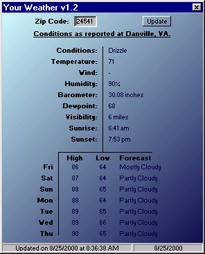



## Your Weather v1\.2 \*Complete Source/Well Documented\* \(Great App\)

### Description

Hopefully my final version here. Really a great application that gets current weather conditions and an extended forecast. Nice Interface, well documented and best of all FREE. I spent a good bit of time on this program and hope you people like. If you do like it let me know by VOTING.
 
### More Info
 

             |
---                |---
**Submitted On**   |2000-08-25 08:37:48
**By**             |[Nathan](https://github.com/Planet-Source-Code/PSCIndex/blob/master/ByAuthor/nathan.md)
**Level**          |Intermediate
**User Rating**    |5.0 (25 globes from 5 users)
**Compatibility**  |VB 5\.0, VB 6\.0
**Category**       |[Complete Applications](https://github.com/Planet-Source-Code/PSCIndex/blob/master/ByCategory/complete-applications__1-27.md)
**World**          |[Visual Basic](https://github.com/Planet-Source-Code/PSCIndex/blob/master/ByWorld/visual-basic.md)
**Archive File**   |[CODE\_UPLOAD93038252000\.zip](https://github.com/Planet-Source-Code/nathan-your-weather-v1-2-complete-source-well-documented-great-app__1-10996/archive/master.zip)

